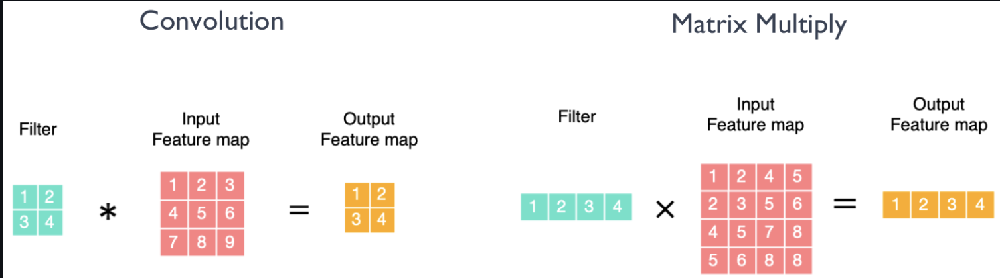

# 关键设计指标

## 评估

TODO

### 算术强度

### 操作字节

# 矩阵乘法

> 矩阵乘运算在 AI 芯片的具体过程，了解它的执行性能是如何被优化实现的

## Conv 等效 矩阵乘法

## Tiling 分块

- 并行化
- 缓存复用

## 矩阵乘的优化
> 来自https://github.com/chenzomi12/AIInfra/blob/main/01AIChip/01Foundation/05Matrix.md
矩阵乘作为计算机科学领域的一个重要基础操作，有许多优化算法可以提高其效率。下面我们对常见的矩阵乘法优化算法做一个整体的归类总结。

循环优化：通过调整循环顺序、内存布局等手段，减少缓存未命中（cache miss）和数据依赖，提高缓存利用率，从而加速矩阵乘法运算。

分块：将大矩阵划分成小块，通过对小块矩阵进行乘法运算，降低了算法的时间复杂度，并能够更好地利用缓存。

SIMD 指令优化：利用单指令多数据（SIMD）指令集，如 SSE（Streaming SIMD Extensions）和 AVX（Advanced Vector Extensions），实现并行计算，同时处理多个数据，提高计算效率。

SIMT 多线程并行化：利用多线程技术，将矩阵乘法任务分配给多个线程并行执行，充分利用多核处理器的计算能力。

算法改进：如 Fast Fourier Transform 算法，Strassen 算法、Coppersmith-Winograd 算法等，通过矩阵分解和重新组合，降低了算法的时间复杂度，提高了计算效率。

这些优化算法通常根据硬件平台、数据规模和计算需求选择不同的策略，以提高矩阵乘法运算的效率。在具体的 AI 芯片或其它专用芯片里面，对矩阵乘的优化实现主要就是减少指令开销，可以表现为两个方面：

**让每个指令执行更多的 MACs 计算。**比如 CPU 上的 SIMD/Vector 指令，GPU 上的 SIMT/Tensor 指令，NPU 上 SIMD/Tensor,Vector 指令的设计。

**在不增加内存带宽的前提下，单时钟周期内执行更多的 MACs。**比如英伟达的 Tensor Core 中支持低比特计算的设计，对每个 cycle 执行 512bit 数据的带宽前提下，可以执行 64 个 8bit 的 MACs，大于执行 16 个 32bit 的 MACs。

# 比特位宽

## 有哪些

- FP16
- FP32
- TF32(Tensor Float)
- FP8(H100整出来的)

> by ZOMI
> 数据位宽的降低可以带来了更大的吞吐和更高的计算性能，虽然精度有所降低，但是在 LLM 场景下，采用技术和工程手段，FP8 能够提供与更高精度类型相媲美的结果，同时带来显著的性能提升和能效改善，未来肯定会产生更多的应用实践，以后 AI 芯片的设计也要考虑对 FP8 数据类型的支持。

## 降低比特位宽

好处：
- MAC输入输出位宽低，数据搬运的开销
- 计算开销（大 $\times$ 大， 设计复杂度）

混合精度的使用的必要性

# CPU

## 工作流程

## 基本构成

Input --> CPU --> Output
        Memory

### 算数单元
ALU

### 寄存器

IR
PC(program count)
AC(累加)
AR(地址寄存器)
DR(数据寄存器)

### 控制单元（CU）

1. 节拍发生器
2. 操作译码器
3. 标志信号

